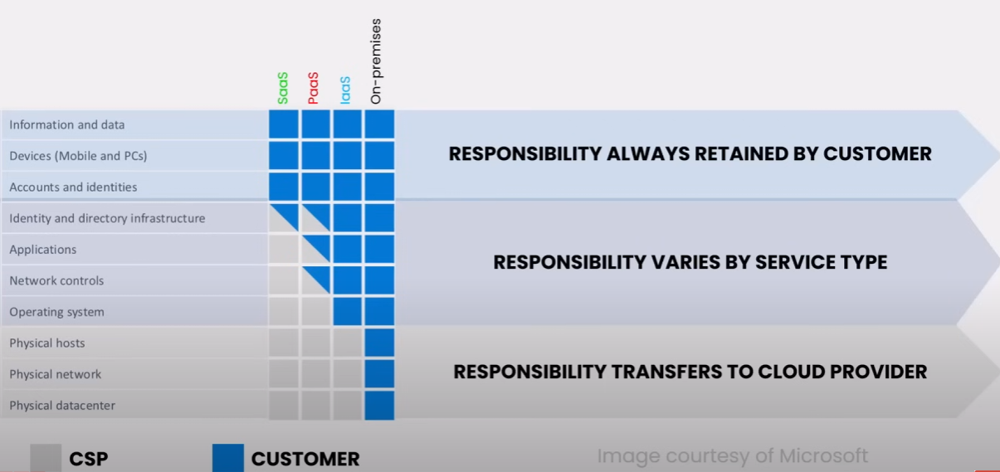

# AZ-900 Azure Fundamentals Exam Cram (2024 Edition) - Full Course

Archive: No
Projects: AZ-900 Exam (https://www.notion.so/AZ-900-Exam-27bef04d80ed42e99e58dbf1ba2cca49?pvs=21)

Video Details

[AZ-900 Azure Fundamentals Exam Cram (2024 Edition) - Full Course](https://www.youtube.com/watch?v=8n-kWJetQRk&t=6450s)

AZ-900 Practice Exam 
100+ questions, no login required!

[https://insidethemicrosoftcloud.com/a...](https://www.youtube.com/redirect?event=video_description&redir_token=QUFFLUhqbXN1Z1BfNWJZRDdTczltVXFueVFIMzFaWm5SUXxBQ3Jtc0tsdkZINmxaNGdHajJrRUVJVU9acjBZVk9UZGliak9jVmp1cVVIZnRPOG95U1RxcUM2MVdPUndwR21naEkwcEwzdjA1UVVWRHpZUnNxOUlWZVlKUmpQYm96VVQ0WVRmVmEyUWdEMktDQjFlSFpJTkF0UQ&q=https%3A%2F%2Finsidethemicrosoftcloud.com%2Faz900quiz&v=8n-kWJetQRk)

PDF Presentation Download - AZ-900 Exam Cram FULL COURSE

[https://1drv.ms/b/s!AmhtzcmYt5AVidcvJ...](https://www.youtube.com/redirect?event=video_description&redir_token=QUFFLUhqbWNWR1prSWRhTVQ2RU1GM09oOXFMUjdEUUVjZ3xBQ3Jtc0tsNUUzVzZaTkZfcGs5aGpLY1lsbWJjdXhxaWYxQ3VMX0xZSVZIanFqZy1fRFVHWVBoeU1MSTFBMUFJVG1BQ194RlRyT0NjbDU2WWZwUHJuQnhJd0ZkazFmWDRRRUN0czlVa2JwYVhiUWY4WGhUS015UQ&q=https%3A%2F%2F1drv.ms%2Fb%2Fs%21AmhtzcmYt5AVidcvJwCy0bilGQtL8w%3Fe%3D0ubev2&v=8n-kWJetQRk)

AZ-900 on MS Learn

[https://docs.microsoft.com/en-us/lear...](https://www.youtube.com/redirect?event=video_description&redir_token=QUFFLUhqbGdpMFBVdUxyUi1TcjVqZ0VPcHdLMVVIVS1Dd3xBQ3Jtc0tuN0lOZ0xKN1ZKaU85WExGWU8zZW0tWEdpVVNIRzFiV2ZBYVVkY29RMDIzYlZINExsQUpzdFlHYWIwSTF4OFBSUDBmeXVBeHRuTVJfd2ludVBPMGhFNUZvRzF0YlNaakZDMlFDdVRnYUJRV19PN21Tbw&q=https%3A%2F%2Fdocs.microsoft.com%2Fen-us%2Flearn%2Fcertifications%2Fazure-fundamentals%2F%3Ftab%3Dtab-learning-paths&v=8n-kWJetQRk)

[BOOK] Microsoft Azure Fundamentals (AZ-900) Exam Reference

[https://amzn.to/3tEok2v](https://www.youtube.com/redirect?event=video_description&redir_token=QUFFLUhqbl9mQ2NQQXdheUV5N1JxNEhXVjFYajFib0tvd3xBQ3Jtc0ttaWlHZmVOa1FYMHFJRXoyVE1LTDhtS1pnQlZHZXU2cnJxN1ZHOFVoT1hnTlhBb1U3cURNRVlEX1AwRUhZQ09QRWZaRG9pVGJ3SG1qdklfemoxVDZINi1LdUtIdXowdnpwT0cyd0t5eWlxX1psNzBsYw&q=https%3A%2F%2Famzn.to%2F3tEok2v&v=8n-kWJetQRk)

# DOMAIN 1: Describe Cloud Concept

- describe cloud computing
- shared reponsibility model
- cloud models, - public, private and hybrid
- Appropriate use cases for each cloud model
- desc consumption-based model (budget and pricing)
- compare cloud pricing models
- desc serverless

## 1.1 Define Cloud Computing

according to NIST SP 800-145  - “Cloud computing is a model for enabling universal, convenient, on-demand network access … to a shared pool of configurable computing resources that can be rapidly provisioned and released with minimal management effort or service provider interaction. 

According Microsoft - Cloud computing is the delivery of computing services over the internet

Expands the traditional IT offerings to include services like 

IoT

ML

AI

## Share Responsibility Model

## Better Security in the Cloud ?

## 1.1 Describe Cloud Model

Benefits of Cloud Computing -  Cloud is **COST EFFECTIVE, GLOBAL, SECURE, SCALABLE, ELASTIC and ALWAYS CURRENT**

|  | Public Cloud | Private Cloud | Hybrid |
| --- | --- | --- | --- |
| Description | datacenter in your public cloud platform | Cloud env in your own datacenter | combination private and public cloud |
| Advantages | Scalability, agility, PAYG, no maintenance, and low skills | can support legacy system / software, full control and compliance | allow your apps run in the right location with right use cases  and can leverage benefit both public and private cloud |

### Economies of Scale

The ability to do things more efficiently or at a lower-cost per unit when operating at a larger scale. 

### Capital Expanditures

CapEX is spending of money on physical infrastructure up front

### Operating Expenditures

OpEX is spending money on services or products now and being billed as you go

**CLOUD INCREASING OPEX SPENDING AND REDUCING CAPEX SPENDING**

| Consumption-based model  | Pay for what you use , typically per unit of time or capacity (per minute, per-GB, per-execution) |
| --- | --- |
| Fixed price model | You provision resources and pay for those instances whether you use them or not - ensure predictable cost for business  |
| Serverless Architecture  | a cloud computing execution model where the cloud provider dynamically manages the allocation and provisioning of servers.

hosted as a pay-as-you-go model based on use.

Resources are stateless, servers ephemeral and often capable of being triggered.

example : Function-as-service |

### Different between PaaS and Serverless

### Serverless services

| Logic App | Functions | Event Grid |
| --- | --- | --- |
| cloud service that helps you schedule, automate, and orchestrate task, business processes and workflows | An event driven, compute-on-demand experiance that extends the existing Azure application platform  | Enables you to easily manage events across many different Azure services and applications  |
| can choose from a gallery of hundreds of pre-built connectors for MSFT & 3rd party service | … with capabilities to implement code triggered by events occurring in Azure as well as on-premises systems. | Once a subscription is created, Event Grid will push events to the configured destination |
| Foundation of Power Automate (MS Flow) | Enable billing per execution rather that by time | Makes it easy for any developer to utilize the “push” model instead of the inefficient “pull” across their Serverless architecture |

 

## 1.2 Describe cloud computing

- describe the benefits of high availability and scalability in the cloud
- describe the benefits of reliability and predictability in the cloud
- describe the benefits of security and governance in the cloud
- describe the benefits of manageability in the cloud

AVAILABILITY : → Encompasses availability of the infrastructure, application, and services, Generally expressed as a number of 0’s

SCALABILITY : → The ability of the system to handle the growth of the users or work

ELASTICITY : → The ability of a system to automatically grow and shrink based on the app demand

AGILITY : → Focuses on the speed and ease of allocating and deallocating resources. Allow for vast amounts of computing resources provisioned in minutes

FAULT TOLERANCE → The ability of the system to handle faults in a service like power, network, or hardware failures - refer to component level failures

HIGH AVAILABILITY → The ability to keep services up and running for long periods of time - refer to services level failures

DISASTER RECOVERY → The ability to recover from an event which has taken down a cloud service. - generally focuses on recovery in the event of a service or site failure

RELIABILITY → The ability of a system to recover from failures and continue to functions

Consist of the two principles

RESILIENCY - aim to return an application to a fully functioning state after a failure occurs

AVAILABILITY - consistent access to your application - uptime 

### Characteristics common in cloud platforms and services

RAPID ELEASTICITY AND SCALABILITY

→ Allows the customer to grow or shrink the IT footprint as necessary to meet needs without excess capacity

- What different ?
    - Elasticity → the ability of a system to automatically grow and shrink based on app demand.
        - capabilities can be rapidly provisioned and de-provisioned (scale-in, scale-out) - Additional instances quickly auto-deployed
    - Scalability → The ability of the system to handle growth of users or works.
        - Ability to grow as demand increases. - controlled by SKU or tier selection
        - 
    

PREDICTABILITY → Azure enables solutions with predictable cost and performance 

### SECURITY IN AZURE

- Protection of customer data (access control, encryption)
- Protection of cloud applications
- protection of cloud infrastructure

All models have built-in DDoS protection from Azure DDoS

— IaaS gives the customer more control versus PaaS and SaaS, but also places more security responsibility on the customer.

AZURE DDoS → 

- standard tier provides enhanced DDoS mitigation features to defend against DDoS attacks
- Also includes logging, alerting, and telemetry not included in the free Basic tier present by default.

GOVERNANCE →

- Set of rules and policies that guide an organization’s cloud operations
- To ensure data security, manage risk, control costs, and improve efficiency
- The guidance and guardrails that ensure we’re as secure, consistent and efficient as possible.
- Deployment templates help ensure deployed resources meet corporate standard and regulatory requirements.

CLOUD ADOPTION FRAMEWORK → Guidance designed to help you create and implement the business and technology strategies to succeed in Azure.

MANAGEABILITY ON THE CLOUD

- Automatically scale resource deployment based on need
- deploy resources based on a preconfigured template
- monitor the health of resources and automatically replace failing resources.
- receive automatic alerts based on configured metrics.

## 1.3 Describe cloud service types

### Shared responsibility model

### Cloud Model & Services - IAAS

- CSP provides building blocks, like networking, storage and compute
- CSP manages staff, HW, and datacenter
- Example

**IAAS Use Cases**

- During testing and development. VMs provide a quick and easy way to create different OS and application configurations.
    - Test and Dev teams can easily deploy and then delete the VMs when they no longer need them.
- When running application in the cloud. Can provide technical and financial benefits, as when an application might need to handle fluctuations in demand.
    - Shutting down VMs when you don’t need them or quickly starting them up to meet a sudden increase in demand means you pay only resources you use.
- When extending your datacenter to the cloud. Can extend the capabilities of its own on-premises network by creating a virtual network in Azure and adding VMs to that virtual network
    - Make it easier/ less expensive to deploy than on-premises
- During disaster recover. Enables significant cost saving by using an IaaS-based approach to disaster recovery.
    - Enables push button, automated VM spin up and shutdown in a disaster.

### Cloud Model & Services - PAAS

- Customer is responsible for deployment and management of apps
- CSP manages provisioning, configuration, hardware, and OS
- Example
    
    
    

**PAAS Use Cases**

- Development framework
    - PaaS provides a framework that developers can build upon to develop or customize cloud-based applications.
    - PaaS lets developers create applications using built-in software components
    - Cloud features such as scalability, high-availability, and multi-tenant capability are included, reducing the amount of coding that developers must do.
        - BOTTOM LINE: Reduce developer effort and increases solution quality
- Analytics or business intelligence
    - Tools provided as a service with PaaS allow organizations to analyze and mine their data, finding insights and patterns and predicting outcomes
    - Improves forecasting, product design decisions, investment returns, and other business decisions.
        - BOTTOM LINE: simplifies data analysis and improve business outcomes.
    
    ### Cloud Model & Services - SAAS
    
    
    
    - Customer just configures features.
    - CSP is responsible for management, operating, and service availability
        - Customer has some responsibility in access management and data recovery
    - Example
        
        
        
    
    **SAAS Use Cases**
    
    Common SaaS use cases include:
    
    - Email and messaging
    - Business productivity application
    - Finance and expense tracking
        - BOTTOM LINE: These are important utility functions not core to the company’s purpose.
    - SaaS enables companies to securely and reliably outsource a variety of functions so they can focus on revenue generation
    
    # DOMAIN 2: Describe Azure Architecture and Services
    
    1. Describe the core architectural components of Azure
    2. Describe Azure compute and networking services
    3. Describe Azure storage services
    4. Describe Azure identity, access, and security
    
    ## 2.1 Describe the core architecture components.
    
    Describe Azure region, region pairs, and sovereign region
    
    - Availability Zones
    - Datacenters
    - Resources and Resource Groups
    - Subscriptions
    - Management Groups
    - Resource hierarchy
    
    **Describe the core architectural components of Azure**
    
    **AZURE GEOGRAPHY** → A discrete market, typically containing two or more regions, that preserves data residency and compliance boundaries
    
    
    
    **AZURE REGION** → A set of datacenters deployed within a latency-defined perimeter and connected through a dedicated regional low-latency network
    
    
    
    AZURE SOVEREIGN REGION → Special regions that you might need to for compliance or legal purposes:
    
    **Government (Fed govt, or DoD), China**
    
    Having physical and logical isolation
    
    operate by special trustee
    
    **REGION PAIRS** → A relationship between 2 Azure Regions within the same geographic region for disaster recovery purposes. 
    
    
    
    
    
    MANAGEMENT GROUP → Provide a level of scope above subscriptions
    
    each directory is given a single to-level management group called “Root”
    
    - Can be used to aggregate policy and initiative assignments via Azure Policy
    - Can contain multiple subscriptions
    - All new subscription will be placed under the root management group by default
    
    SUBSCRIPTION → Logical container used to provision resources in Azure
    
    Why would I create multiple subscription? 
    
    1. when subscription limits are reached
    2. to use different payment methods
    3. to isolate resources between departments, projects, etc
        
        
        Are a unit of management, billing , and scale within Azure
        
        Serve as a management boundary for assigning Azure policies, governance, and isolation. 
        
    
    RESOURCE GROUPS → A container that holds related resources for an Azure solution. 
    
    Used to group resources that share a common resource lifecycle
    
    A container that holds for resources with a common lifecycle
    
    RESOURCES → Entity managed by Azure, like a virtual machine, virtual network, or storage account. 
    
    
    

AVAILABILITY ZOINES

Unique physical I and isolation

AZURE DATACENTERS

Physical buildings that contain **thousands of servers and other hardware** to provide cloud computing services

Azure datacenters are **located all over the world and are organized into regions**.

Designed to be secure, reliable and efficient, leveraging economies of scale and multi-tenant.

## 2.2 Describe Azure compute and networking services

- compare compute types, including containers, virtual machines, and functions
- Describe virtual machine options, including Azure virtual machines, Azure Virtual Machine Scale Sets, availability sets, and Azure Virtual Desktop
- Describe the resources required for virtual machines
- Describe application hosting options, including web apps, containers, and virtual machines
- Describe virtual networking, including the purpose of Azure virtual networks, Azure virtual subnets, peering, Azure DNS, Azure VPN Gateway, and ExpressRoute
- Define public and private endpoints

### COMPARE COMPUTE TYPE - VM OPTIONS

**AZURE VMs** → Server virtualization (**compute) on-demand** without need for hardware purchase

**VM Scale sets**

- Allow you to create and manage a group of identical, load-balanced VMs.
- The number of VM instances can be automatically increase or decrease in response to demand or based on a schedule
    - Focus = scale (scalability, capacity)

**VM availability sets** 

- Help build a more resilient, highly available environment by staggering VM updates and ensuring varied power and network connectivity.
    - Focus = resiliency (availability)
- They do this through two mechanisms:
    - **FAULT DOMAIN**
        - Allow you to apply updates while knowing that only one update domain grouping will be offline at a time
    - **UPDATE DOMAINS.**
        - Groups your VMs by common power source and network switch.
        - By default, an availability set will split your VMs across up to three fault domains.

**AZURE VIRTUAL DESKTOP** → A desktop and app virtualization service that runs in Microsoft Azure

- Enable IT Pros and MSPs to create Windows 10 & 11 virtual desktops in Azure
    
    

**AZURE CONTAINER INSTANCE (ACI)** 

Run Docker containers on-demand in a managed, serverless Azure environment.

A solution for any scenario that can operate in isolated containers, without orchestrations.

**AZURE KUBERNETES SERVICES (AKS)**

- A hosted Kubernetes service, where Azure handles critical tasks like health monitoring and maintenance for you.
- You pay only for the agent nodes within your clusters, not for the masters (free tier)
- For a financially backed SLA, you pay a few cents per hour for cluster management. (PRODUCTION ENVIRONMENT)

**VM RESOURCES REQUIREMENTS**

For Azure VM you need this requirement 

1. Virtual Disks
2. Virtual Network (VNET)
3. Network Interface (Virtual NIC)
4. Network Security Group
5. Public IP Address 

### APP HOSTING OPTIONS

**APP Services** → An HTTP-based service for hosting web apps, REST APIs, and mobile back ends.

Types of app service style include

| WEB APPS | Using http://ASP.NET, ASP.NET core, Java, Ruby, Node.js, PHP or Python. - Run on Windows or Linux as host OS |
| --- | --- |
| API APPS | Build REST-based web APIs by using your choice of language and framework - Full Swagger support and publish to Azure Marketplace |
| WEB JOBS | Run a program (.exe, Java, PHP, Python, or Node.js) or script (.cmd, .bat, Powershell, or Bash) in the same context as a web app, API app, or mobile app - can be scheduled or run by a trigger.  - Often used to run background tasks as part of your application logic. |
| MOBILE APPS | Used to quickly build a back end for iOS and Android apps - Enables auth with social identity providers, send push notifications, and execute backend logic. |

**NETWORK CORE SERVICES IN AZURE**

**VIRTUAL NETWORK (VNET)**

- Create a **dedicated private cloud-only network**
- Securely extend your data center (Site-to-Site VPN)
- Enable hybrid cloud scenarios
- VM in different VNETS cannot communicate by default!

**VIRTUAL SUBNET** 

- **Segment address space of VNET** to create sub-networks
- Allows Azure resource deployment into a specific subnet
- Can affect outbound access and routing traffic between resources

**VPN GATEWAY**

- a virtual network gateway that sends encrypted traffic between an Azure VNET and on-premises location over the Internet
- **Core component of “hybrid cloud”**
- site-to-site VPN traffic traverses the internet

**VNET PEERING**

- Enables **seamless connection of two or more Virtual Net**work in Azure.
- Two networks function as one in terms of connectivity
- REMEMBER: Resources different VNETS cannot communicate by default!!!

**EXPRESSROUTE**

- **extends your on-premises networks** into **Azure over a private connection** with the help of a connectivity provider

**AZURE DNS** 

- a hosting service for DNS domain that provides name resolution by using Microsoft Azure Infra
- can provide INTERNAL and EXTERNAL DNS

**SERVICE ENDPOINT** → Provides a way to **lock down access to all instances** of a PaaS service to a VNET

**ACCESSIBLE** from **PUBLIC** internet

**PRIVATE ENDPOINT** → Grant access to a specific instances (resource) of a PaaS service in your VNET on a private IP address

Enables access from on premises without public endpoint.

**CONNECTIVITY EXAMPLE**

**NETWORK SECURITY SERVICES IN AZURE**

**DEFENSE IN-DEPTH**

- A layered (defense in depth) approach that does no rely on one method to completely protect your environment

**NETWORK SECURITY GROUP**

- Contains security rules that allow or deny inbound network traffic to, or outbound network traffic from, several type of Azure resources
- For each rule, you can specify source and destination and protocols.
- can be applied to a subnet or network adapter

**AZURE FIREWALL**

- A managed, cloud-based network security service that protect your Azure Virtual Network resources.
- It’s a fully **stateful firewall as a service** with **built-in high availability** and unrestricted cloud scalability.

**AZURE DDoS**

- Standard tier provides enhance DDoS mitigation features to defend against DDoS attacks.
- Also includes logging, alerting, and telemetry not include in the free basic tier present by default.

## 2.3 Describe Azure storage services

- Compare Azure Storage services
- Describe storage tiers
- Describe redundancy options
- Describe storage account options and storage type
- Identify options for moving files, including AzCopy, Azure Storage Explorer, and Azure File Sync
- Describe migration options, including Azure Migrate and Azure Data Box

**COMPARE AZURE STORAGE SERVICES**

**BLOB STORAGE** → Storage optimized for storing massive amount of unstructured data

> UNSTRUCTURED (Image, video files, Social media posts) -  Data that cannot be contained in a row-column database and does not have associated data model
> 

> STRUCTURED (Excel, MSSQL, MySQL, PostgreSQL) - Data contained in rows and columns such as an EXCEL spreadsheet or relational database
> 

**FILE STORAGE** → Fully managed file shares in Azure accessible via SMB or NFS

**DISK STORAGE** → Azure managed disks are block-level storage volumes that are managed by Azure and used with Azure VMs

TABLE STORAGE → a service that stores structured NoSQL data in Azure, including a schemeless key / attribute store

QUEUE STORAGE → a service for storing large numbers of messages, accessible from anywhere via authenticated HTTP or HTTPS calls.

**STORAGE TIER**

- Azure storage hot, cool, cold and archive access tiers to store blob object data in a cost-effective manner
- Use lifecycle management policies to automate tiers.

**DESCRIBE STORAGE TIERS**

| ARCHIVE | Lowest storage costs, buy high access costs.  | An offline tier optimized for storing data that is rarely accessed, and that has flexible latency requirements, on the order of hours. | Should be stored a minimum of 180 days |
| --- | --- | --- | --- |
| COLD | Lower storage costs and higher access cost compare to Cool | An online tier optimized for storing data that is rarely accessed or modified, but still requires fast retrieval | should be stored a minimum of 90 days |
| COOL | Lower storage costs and higher access costs compared to Hot | An online tier optimized for storing data that is infrequently accessed or modified. | should be stored a minimum of 30 days |
| HOT | Highest storage costs, but lowest access costs | An online tier optimized for storing data that is accessed  or modified frequently |  |

**DESCRIBE STORAGE REDUNDANCY OPTIONS**

| LRS - LOCALLY REDUNDANT STORAGE | Copies your data synchronously three times within a single physical location in the primary region |
| --- | --- |
| ZRS - ZONE REDUNDANT STORAGE | Copies your data synchronously across three region Azure availability zones in the primary region. |
| GRS - GEO-REDUNDANT STORAGE | Copies your data synchronously three times within a single physical location in the primary region using LRS. It then copies it asynchronously to a single physical location in the secondary region ( 3copies using LRS ) |
| GZRS - GEO-ZONE REDUNDANT STORAGE | Copies your data synchronously three times within the primary region using ZRS. It then copies it asynchronously to a single physical location in the secondary region |

**AZURE FILE MOVEMENT OPTIONS**

| AzCopy | A command-line utility that you can use to copy blobs or files to or from your storage account |
| --- | --- |
| Azure Storage Explorer | A standalone app that provides a graphical interface to manage files and blobs in your Azure Storage Account.  |
| Azure File Sync | A tool that let you centralize your file shares in Azure Files and keep the flexibility, performance, and compatibility of a Windows file server. Once installed on a local Windows, it will automatically stay bi-directionally synced with your files in Azure |

**AZURE MIGRATION OPTIONS**

**AZURE MIGRATE** 

- A service that provides a simplified migration, modernization, and optimization for Azure.
- Includes all pre-migration steps such as discovery, assessment, and right-sizing.
- It is a hub of services and tools designed to detect, analyzed and facilitate the migration of any type of workload to Azure.

**AZURE DATA BOX**

- A cloud solution that lets you send terabytes of data into and out of Azure in a quick, inexpensive, and reliable fashion.
- Customers are shipped a proprietary Data Box storage device
- Ideally suited to transfer data sizes larger that **40 TBs**
- In scenarios with **limited or no network connectivity.**

## 2.4 Describe Azure Identity, Access, and Security

- Describe directory services in Azure, including Microsoft Entra ID and Microsoft Entra Domain Services.
- Describe authentication methods in Azure, including single sign-on (SSO), multi-factor authentication (MFA), and passwordless.
- Describe external identities in Azure, Including business-to-business (B2B) and business-to-customer (B2C)

### Identify Core Azure Identity Services

AuthN and AuthZ → 

- Authentication (AuthN) is the process of proving that you are who you say you are. (IDENTITY)
- Authorization (AuthZ) is the act of granting an authenticate party permission to do something. (ACCESS)

ENTRA ID → Microsoft’s cloud-based identity and access management service which helps your employees sign in and access resources, including :

Internal resources, such as apps on your corporate network or custom cloud apps

External resources, such as Microsoft 365, the Azure portal, and many SaaS apps. 

AUTHENTICATION METHODS IN AZURE.

SINGLE SIGN-ON (SSO) → 

- single sign-on means a user doesn’t have to sign into every application they use
- The user logs in once and that credential is used for multiple apps
- often called “**modern authentication”**

MFA →

- Entra ID works by requiring two or more the following authentication methods:
    - Something you know (pin or password)
    - Something you have (trusted device)
    - Something you are (biometric)
    

**OATH TOKENS**

What is an OATH token and how does it work?

OATH (Open Authentication) is an open standard that specifies how time-based, one-time password (TOTP) codes are generated. 

Software OATH tokens (Example: Microsoft Authenticator App

- Typically applications. Entra ID generates the secret key, or seed that into the app and used to generate each OTP

Hardware OATH tokens

- small hardware devices that look like a key fob that displays a code that refreshes every 30 or 60 seconds, with secret key / seed pre-programmed.

**FIDO2/ PASSWORDLESS**

What is FIDO2 and how does it work?

- Uses public-key (asymmetric) cryptography for user authentication
- User has a physical device (USB or NFC)
- Authentication Sequence
    
    
    

WINDOWS HELLO FOR BUSINESS

- an authentication feature built into Windows 10, replaces passwords with strong two-factor authentication on PCs and mobile devices.
    - Allow users authenticates to :
        - Microsoft account
        - Active Directory account
        - Entra ID account
        - Identity Provider Services OR
        - Relying party services that support Fast ID Online (FIDO) v2.0 authentication
- Windows Hello is for personal devices and uses a pin or biometric gesture
- Windows Hello for Business leverages key-based or certificate-based authentication.

Windows Hello for Business solves following problems

- Strong passwords can be difficult to remember and users often reuse passwords on multiple sites.
- Server breaches can expose symmetric network credentials (Passwords).
- Passwords are subject to replay attacks
- Users can inadvertently expose their passwords due to phishing attacks.

EXTERNAL IDENTITIES

1. B2B Collaboration (Support Entra ID and social Identities)
    1. Enable external users to use their preferred identity to sign into your Microsoft or other enterprise application (SaaS apps, custom-develop apps, etc.)
2. B2B direct connect (support multiple two-way trusts 
    1. Establish a mutual, two-way trust with another Entra ID organizations for seamless collaboration
    2. Useful for heavy, daily collaboration with close business partners.
3. Business-to-Customer (B2C) (Support Entra & social identities
    1. Publish modern SaaS apps or custom-developed apps to consumers and customers, while using Entra ID B2C for identity and access management.
4. Entra ID multi-tenant organization
    1. Collaborate with multiple tenants in a single Entra ID organization via cross-tenant synchronization 
        
        (Good for conglomerates, mergers, multi-cloud, dept/test/staging tenants)
        

ENTRA ID CONDITIONAL ACCESS 

Used by Entra ID to bring signals together, to make decisions, and enforce organizational policies. 

AZURE RBAC

Built on Azure Resource Manager and provides fine-grained access management of Azure resources

(one element of implementing “least privilege”)

ZERO TRUST ARCHITECTURE

THREE Principle of Zero Trust

1. Verify explicitly
    1. Always authenticate and authorize based on all available data points
2. Use least privileged access
    1. Limit user access with Just-In-Time and Just-Enough-Access (JIT/JEA), risk-based adaptive policies, and data protection.
3. Assume breach
    1. Segment access to minimize blast radius
    2. Verify end-to-end encryption and use analytics to get visibility, drive threat detection, and improve defenses. 

ZERO TRUST SECURITY MODEL

Unlike the “trust but verify” approach, in Zero Trust, no entity is trusted by default.

It based on three principles: Assume breach, verify explicitly, and least privilege access

 

| Identities | - Identities should be explicitly verified with strong authentication using all available data points and Users should be granted least privilege access |
| --- | --- |
| Devices | should be monitored for health and compliance and updated when necessary |
| Apps | Only approved apps should be allowed to access company data, and permissions managed |
| Data | should be classified, labeled, and encrypted based on its attributes, at rest and in motion. |
| Infrastructure | Infrastructure version, configuration, JIT access, should be managed. - Telemetry should be used to detect anomalous activity that may indicate attack |
| Network | Networks should be segmented to limit data access and reduce threat exposure - Real time threat protection, end-to-end encryption, monitoring, and analytics should be employed. |

Defense in-Depth → A layered (defense in depth) approach that does not rely on one method to completely protect your environment. 

Defender for Cloud → A unified infrastructure security management system that strengthens the security posture of your cloud and on-premises data centers.

- Provides security guidance for compute, date, network, storage, app, and other services
- Include support for both Azure and on-premises workloads, as well as other public clouds (support multi-cloud)

# DOMAIN 3: Describe Azure Management and Governance

## 3.1 Describe cost management in Azure

- Describe factors that can affect costs in Azure
- Compare the pricing calculator and the Total Cost Ownership (TCO) calculator
- Describe cost management capabilities in Azure
- Describe the purpose of tags

DESCRIBE FACTORS THAT CAN AFFECT COSTS

1. COST IMPACTS → Factors that can affect Azure resource costs include resource types, services, locations, ingress and egress traffic. 
2. REDUCING COST → Factors that can reduce costs include reserved instances, reserved capacity, hybrid use benefit, spot pricing. 

DESCRIBE METHOD FOR PLANNING AND MANAGING COST

Reserve Instances 

- Reserve virtual machines in advance and save up to 72 percent compare to PAYG pricing with 1-yr or 3-yr commitment

Reserve Capacity

- Achieve significant savings on Azure SQL Database, Azure Cosmos DB and Azure Synapse Analytics and Azure Cache for Redis (Discount is product-specific)
- Enables you to more easily manage costs across predictable and variable workloads and help optimize budgeting and forecasting - Also include 1-year and 3-year options

Hybrid Use Benefit

- A licensing benefit that helps you to significantly reduce the costs of running your workloads in the cloud
- Let’s you use your on-premises Software Assurance-enabled Windows Server and SQL Servicer licenses on Azure

Spot Pricing 

- Access unused Azure compute capacity at deep discounts - up to 90 percent compared to pay-as-you-go prices
- Apply to Azure VMs only!!!
- Use for Workloads that can be interrupted without harm

Pricing Calculator

- Interactive calculator that allows you to estimate the expected monthly Azure cost.
- Can choose region, services, options and SKUs.

TCO Calculator

- A tool that helps estimate cost savings you can achieve by migrating application workloads to Azure
- Allow you to compare the TCO of different Azure services and regions and provides a details breakdown of cost components and potential savings.

Azure Cost Management

- A suite of tools provided by Microsoft that help you analyze, manage, and optimize costs of your workloads.

Tags

- A name and value pair used to logically organize Azure resources, resource groups and subscriptions into a logical taxonomy
- Tags can be the basis for applying business policies or tracking costs
- You can also enforce tagging rules with Azure Policies
    - Example of common tags include owner, cost center, app/service and environment

## 3.2 Describe features and tools in Azure for governance and compliance

**DESCRIBE AZURE GOVERNANCE FEATURES**

MICROSOFT PURVIEW

- Unified data governance service that helps organizations manage and govern their on-premises, multi-cloud, and SaaS data.
- Automates data discovery by providing data scanning and classification for assets across the organizaion’s data estate

CLOUD GOVERNANCE

| POLICY | Definition of conditions which you want to control /govern  |
| --- | --- |
| INITIATIVE | Collection of Azure policy definitions that are grouped together towards a specific goal |
| BLUEPRINT | Container for composing sets of standards, patterns, and requirements for implementation of Azure cloud services, security, and design - Often used in the same sentence as the phase “new environments” |

RESOURCE LOCKS

- Prevent other users in your organization from accidentally deleting or modifying critical resources
- The lock overrides any permissions the user might have

## 3.3 Describe features and tools for managing and deploying Azure resources

**AZURE MANAGEMENT TOOLS**

| Azure Portal | Web-based, unified console where you can manage your Azure subscription using a graphical user interface |
| --- | --- |
| Azure Cloud Shell | An interactive, authenticated, browser-accessible shell for managing Azure resources. - In includes both Bash and Powershell options |
| Azure PowerShell | A set of cmdlets for managing Azure resources directly from the PowerShell command line. |
| Azure Mobile App | App for iOS and Android that enables managing, tracking health and status, and troubleshooting your Azure resources |
| Azure CLI | The Azure command-line interface (Azure CLI) is set of commands used to create and manage Azure resources. - Available on Windows, macOS, and Linux Docker, and Azure Cloud Shell |

DESCRIBE AZURE MANAGEMENT FEATURES AND TOOLS

ARM TEMPLATE

- A JSON file that defines the infrastructure and configuration for your project
- Template use declarative syntax and are idempotent, which means you can deploy many times and get same resources and state.
- Used in deployment automation in IaaC

DESCRIBE THE PURPOSE OF AZURE ARC

- A platform that extends Azure services to run applications across datacenters, edge, and multi-cloud environments.
- Provides a consistent development, operations, and security model to run applications on new and existing hardware.
- Simplifies governance and management by delivering a consistent multi-cloud and on-premises management platform
- Extends ARM capabilities to Linux and Windows Servers, as well as Kubernetes clusters on any infrastructure across on-premises, multi-cloud, and the edge.

WHAT IS AZURE RESOURCE MANAGER ?

- Azure Resource Manager (ARM) is the deployment and management service for Azure
- It provides a management layer that enables you to create, update and delete resources in your Azure account .

INFRASTRUCTURE AS A CODE (IaaC)

- the management of infrastructure (networks, VMs, load balancers, and connection topology) described in code
- just as the same source code generates the same binary, code in the IaaS model results in the same environment every time it is applied.
- IaaC is a key DevOps practice and is used in conjunction with continuous integration and continuous delivery (CI/CD)

## 3.4  Describe monitoring tools in Azure.

**DESCRIBE AZURE MANAGEMENT TOOLS**

AZURE ADVISOR

- Scan your Azure configuration and recommends changes to optimize deployments, increase security, and save you money
- analyzes the configuration of the resource deployed in the Azure subscriptions

AZURE MONITOR

- A service that collects monitoring telemetry from variety of on-premises and Azure sources
- Can be monitor resources like app, VMs, guest OS, containers, DBs, security, and network events
- Azure Monitor aggregates and stores this telemetry in an Azure Log Analytics (backend data store) instances

AZURE MONITOR ALERTS

- A proactive way to detect and address issues before they become critical
- You can create alerts on any metric or log data sources in the Azure Monitor data platform
- Types include metric, log, activity, service health, resource health, smart detection, and Prometheus
- View alerts in the portal, send notifications, or initiate automated responses (run the Azure Functions or Azure Automation runbooks)

APPLICATION INSIGHT

- An extension of Azure Monitor and provides application performance, and usage of your web applications.
- Enables proactive understanding of app performance and reactive review of app execution to determine root cause

AZURE SERVICE HEALTH

- Notifies you about Azure service incidents and planned maintenance so you can take action to mitigate downtime.